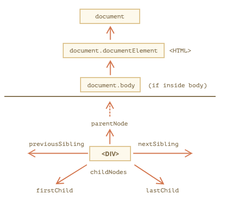

# DOM 탐색하기

- DOM을 이용하면 요소와 요소의 콘텐츠에 무엇이든 할 수 있습니다. 하지만 무언가를 하기 전엔, 당연히 조작하고자 하는 DOM 객체에 접근하는 것이 선행되어야 합니다.
- DOM에 수행하는 모든 연산은 `document` 객체에서 시작합니다.
- `document` 객체는 DOM에 접근하기 위한 `'진입점’`이죠. 진입점을 통과하면 어떤 노드에도 접근할 수 있습니다.
- 아래 그림은 DOM 노드 탐색이 어떤 관계를 통해 이루어지는지를 보여줍니다.



<br>

## 트리 상단의 documentElement와 body

- DOM 트리 상단의 노드들은 `document`가 제공하는 프로퍼티를 사용해 접근할 수 있습니다.
- `<html>` = `document.documentElement`
- `document`를 제외하고 DOM 트리 꼭대기에 있는 문서 노드는 `<html>` 태그에 해당하는 `document.documentElement`입니다.
- `<body>` = `document.body`
- `document.body`는 `<body>` 요소에 해당하는 DOM 노드로, 자주 쓰이는 노드 중 하나입니다.
- `<head>` = `document.head`
- `<head>` 태그는 `document.head`로 접근할 수 있습니다.

### `document.body`가 null일 수도 있으니 주의하세요.

- 스크립트를 읽는 도중에 존재하지 않는 요소는 스크립트에서 접근할 수 없습니다.
- 브라우저가 아직 `document.body`를 읽지 않았기 때문에 `<head>` 안에 있는 스크립트에선 `document.body`에 접근하지 못하죠.
- 따라서 아래 예시에서 첫 번째 `alert` 창엔 `null`이 출력됩니다.

```js
<html>

<head>
  <script>
    alert( "HEAD: " + document.body ); // null, 아직 <body>에 해당하는 노드가 생성되지 않았음
  </script>
</head>

<body>

  <script>
    alert( "BODY: " + document.body ); // HTMLBodyElement, 지금은 노드가 존재하므로 읽을 수 있음
  </script>

</body>
</html>

// DOM의 나라에서 null은 '존재하지 않음’을 의미합니다.
// DOM에서 null 값은 '존재하지 않음’이나 '해당하는 노드가 없음’을 의미합니다.
```

<br>

## childNodes, firstChild, lastChild로 자식 노드 탐색하기

<br>

[출처]
https://ko.javascript.info/dom-navigation
