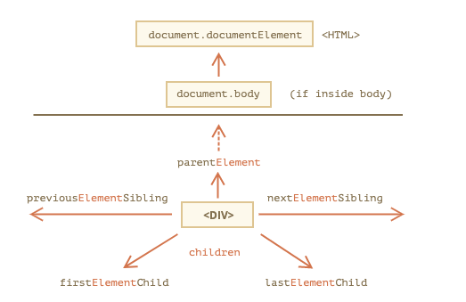

# DOM 탐색하기

- DOM을 이용하면 요소와 요소의 콘텐츠에 무엇이든 할 수 있습니다. 하지만 무언가를 하기 전엔, 당연히 조작하고자 하는 DOM 객체에 접근하는 것이 선행되어야 합니다.
- DOM에 수행하는 모든 연산은 `document` 객체에서 시작합니다.
- `document` 객체는 DOM에 접근하기 위한 `'진입점’`이죠. 진입점을 통과하면 어떤 노드에도 접근할 수 있습니다.
- 아래 그림은 DOM 노드 탐색이 어떤 관계를 통해 이루어지는지를 보여줍니다.


<br>

## 트리 상단의 documentElement와 body

- DOM 트리 상단의 노드들은 `document`가 제공하는 프로퍼티를 사용해 접근할 수 있습니다.
- `<html>` = `document.documentElement`
- `document`를 제외하고 DOM 트리 꼭대기에 있는 문서 노드는 `<html>` 태그에 해당하는 `document.documentElement`입니다.
- `<body>` = `document.body`
- `document.body`는 `<body>` 요소에 해당하는 DOM 노드로, 자주 쓰이는 노드 중 하나입니다.
- `<head>` = `document.head`
- `<head>` 태그는 `document.head`로 접근할 수 있습니다.

### `document.body`가 null일 수도 있으니 주의하세요.

- 스크립트를 읽는 도중에 존재하지 않는 요소는 스크립트에서 접근할 수 없습니다.
- 브라우저가 아직 `document.body`를 읽지 않았기 때문에 `<head>` 안에 있는 스크립트에선 `document.body`에 접근하지 못하죠.
- 따라서 아래 예시에서 첫 번째 `alert` 창엔 `null`이 출력됩니다.

```js
<html>

<head>
  <script>
    alert( "HEAD: " + document.body ); // null, 아직 <body>에 해당하는 노드가 생성되지 않았음
  </script>
</head>

<body>

  <script>
    alert( "BODY: " + document.body ); // HTMLBodyElement, 지금은 노드가 존재하므로 읽을 수 있음
  </script>

</body>
</html>

// DOM의 나라에서 null은 '존재하지 않음’을 의미합니다.
// DOM에서 null 값은 '존재하지 않음’이나 '해당하는 노드가 없음’을 의미합니다.
```

<br>

## childNodes, firstChild, lastChild로 자식 노드 탐색하기

- 앞으로 사용할 두 가지 용어를 먼저 정의하고 설명을 이어나가도록 하겠습니다.
- `자식 노드(child node, children)` 는 바로 아래의 자식 요소를 나타냅니다. 자식 노드는 부모 노드의 바로 아래에서 중첩 관계를 만듭니다. `<head>`와 `<body>`는 `<html>`요소의 자식 노드입니다.
- `후손 노드(descendants)` 는 중첩 관계에 있는 모든 요소를 의미합니다. 자식 노드, 자식 노드의 모든 자식 노드 등이 후손 노드가 됩니다.
- 아래 예시에서 `<body>`는 `<div>`와 `<ul>`, 몇 개의 빈 텍스트 노드를 자식 노드로 갖습니다.

```js
<html>
  <body>
    <div>시작</div>

    <ul>
      <li>
        <b>항목</b>
      </li>
    </ul>
  </body>
</html>
```

- `<div>`나 `<ul>`같은 `<body>`의 자식 요소뿐만 아니라 `<ul>`의 자식 노드인 `<li>`와 `<b>`같이 더 깊은 곳에 있는 중첩 요소도 `<body>`의 후손 노드가 됩니다.
- `childNodes` 컬렉션은 텍스트 노드를 포함한 모든 자식 노드를 담고 있습니다.
- 아래 예시를 실행하면 `document.body`의 자식 노드가 출력됩니다.

```js
<html>
<body>
  <div>시작</div>

  <ul>
    <li>항목</li>
  </ul>

  <div>끝</div>

  <script>
    for (let i = 0; i < document.body.childNodes.length; i++) {
      alert( document.body.childNodes[i] ); // Text, DIV, Text, UL, ... , SCRIPT
    }
  </script>
  ...추가 내용...
</body>
</html>
```

- 예시를 실행하면 흥미로운 점이 하나 발견됩니다. 마지막에 `<script>`가 출력되죠. `<script>` 아래 더 많은 내용(…추가 내용…)이 있지만, 스크립트 실행 시점엔 브라우저가 추가 내용은 읽지 못한 상태이기 때문에 스크립트 역시 추가 내용을 보지 못해서 이런 결과가 나타났습니다.
- `firstChild`와 `lastChild` 프로퍼티를 이용하면 첫 번째, 마지막 자식 노드에 빠르게 접근할 수 있습니다.
- 이 프로퍼티들은 단축키 같은 역할을 합니다. 자식 노드가 존재하면 아래 비교문은 항상 참이 됩니다.

```js
elem.childNodes[0] === elem.firstChild;
elem.childNodes[elem.childNodes.length - 1] === elem.lastChild;
```

- 참고로 자식 노드의 존재 여부를 검사할 땐 함수 `elem.hasChildNodes()`를 사용할 수도 있습니다.

<br>

### DOM 컬렉션

- 위에서 살펴본 `childNodes`는 마치 배열 같아 보입니다. 하지만 `childNodes`는 배열이 아닌 반복 가능한(iterable, 이터러블) 유사 배열 객체인 컬렉션(collection) 입니다.
- `childNodes`는 컬렉션이기 때문에 아래와 같은 특징을 가집니다.

1. `for..of`를 사용할 수 있습니다.

```js
for (let node of document.body.childNodes) {
  alert(node); // 컬렉션 내의 모든 노드를 보여줍니다.
}
```

- 이터러블이기 때문에 `Symbol.iterator` 프로퍼티가 구현되어 있어서 `for..of`를 사용하는 것이 가능하죠.

2. 배열이 아니기 때문에 배열 메서드를 쓸 수 없습니다.

```js
alert(document.body.childNodes.filter); // undefined (filter 메서드가 없습니다.)
```

- 첫 번째 특징은 장점으로 작용합니다. 두 번째 특징은 썩 좋지는 않지만 `Array.from`을 사용하면 ‘진짜’ 배열을 만들 수 있기 때문에 참을 만합니다.
- 컬렉션에 배열 메서드를 사용하고 싶다면 `Array.from`을 적용합시다.

```js
alert(Array.from(document.body.childNodes).filter); // function
```

### DOM 컬렉션은 읽는 것만 가능합니다.

- `DOM` 컬렉션을 비롯해 이번에 설명하는 모든 탐색용 프로퍼티는 읽기 전용입니다.
- `childNodes[i]` = `...`를 이용해 자식 노드를 교체하는 게 불가능하죠.
- `DOM`을 변경하려면 다른 메서드가 필요합니다.

### DOM 컬렉션은 살아있습니다.

- 몇몇 예외사항을 제외하고 거의 모든 `DOM` 컬렉션은 살아있습니다. `DOM`의 현재 상태를 반영한다는 말이죠.
- `elem.childNodes`를 참조하고 있는 도중에 `DOM`에 새로운 노드가 추가되거나 삭제되면, 변경사항이 컬렉션에도 자동으로 반영됩니다.

### 컬렉션에 `for..in` 반복문을 사용하지 마세요

- 컬렉션은 `for..of`를 이용해 순회할 수 있습니다. 그런데 가끔 `for..in`을 사용하려는 사람들이 있죠.
- `for..in`은 절대 사용하지 마세요. `for..in` 반복문은 객체의 모든 열거 가능한 프로퍼티를 순회합니다.
- 컬렉션엔 거의 사용되지 않는 ‘추가’ 프로퍼티가 있는데, 이 프로퍼티까지 순회 대상에 포함하길 원하지 않으실 거니까요.

```js
<body>
  <script>
    // 0, 1, length, item, values 등 불필요한 프로퍼티까지도 출력됩니다. for
    (let prop in document.body.childNodes) alert(prop);
  </script>
</body>
```

<br>

## 형제와 부모 노드

- 같은 부모를 가진 노드는 형제(sibling) 노드 라고 부릅니다.
- `<head>`와 `<body>`는 대표적인 형제 노드입니다.

```js
<html>
  <head>...</head>
  <body>...</body>
</html>
```

- `<body>`는 `<head>`의 ‘다음(next)’ 혹은 '우측(right)'에 있는 형제 노드입니다.
- `<head>`는 `<body>`의 ‘이전(previous)’ 혹은 '좌측(left)'에 있는 형제 노드입니다.
- 다음 형제 노드에 대한 정보는 `nextSibling`, 이전 형제 노드에 대한 정보는 `previousSibling` 프로퍼티에서 찾을 수 있습니다.
- 부모 노드에 대한 정보는 `parentNode` 프로퍼티를 이용해 참조할 수 있습니다.

```js
// <body>의 부모 노드는 <html>입니다
alert(document.body.parentNode === document.documentElement); // true

// <head>의 다음 형제 노드는 <body>입니다.
alert(document.head.nextSibling); // HTMLBodyElement

// <body>의 이전 형제 노드는 <head>입니다.
alert(document.body.previousSibling); // HTMLHeadElement
```

<br>

## 요소 간 이동

- 지금까지 언급한 탐색 관련 프로퍼티는 모든 종류의 노드를 참조합니다. `childNodes`를 이용하면 텍스트 노드, 요소 노드, 심지어 주석 노드까지 참조할 수 있죠.
- 하지만 실무에서 텍스트 노드나 주석 노드는 잘 다루지 않습니다. 웹 페이지를 구성하는 태그의 분신인 요소 노드를 조작하는 작업이 대다수이죠.
- 이런 실제 상황을 토대로 DOM 요소 노드 탐색이 어떻게 이루어지는지 알아봅시다.



- 위 그림 속 관계는 챕터 앞쪽에서 다뤘던 관계와 유사해 보입니다. Element라는 단어가 추가된 점만 다르네요.
- `children` 프로퍼티는 해당 요소의 자식 노드 중 요소 노드만을 가리킵니다.
- `firstElementChild`와 `lastElementChild` 프로퍼티는 각각 첫 번째 자식 요소 노드와 마지막 자식 요소 노드를 가리킵니다.
- `previousElementSibling`과 `nextElementSibling`은 형제 요소 노드를 가리킵니다.
- `parentElement` 는 부모 요소 노드를 가리킵니다.

<br>

[출처]
https://ko.javascript.info/dom-navigation
