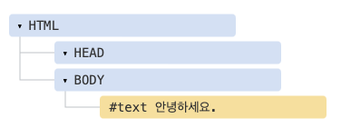

# DOM 트리

- `HTML`을 지탱하는 것은 태그(tag)입니다.
- 문서 객체 모델(DOM)에 따르면, 모든 `HTML` 태그는 객체입니다. 태그 하나가 감싸고 있는 ‘자식’ 태그는 중첩 태그(nested tag)라고 부릅니다. 태그 내의 문자(text) 역시 객체입니다.
- 이런 모든 객체는 자바스크립트를 통해 접근할 수 있고, 페이지를 조작할 때 이 객체를 사용합니다.
- `document.body`는 `<body>` 태그를 객체로 나타낸 것이죠.
- 아래 예시를 실행하면 `<body>`가 3초간 붉은색으로 변경됩니다.

```js
document.body.style.background = "red"; // 배경을 붉은색으로 변경하기

setTimeout(() => (document.body.style.background = ""), 3000); // 원상태로 복구하기
```

- 위 예시에선 `document.body`의 배경색을 바꾸기 위해 `style.background`을 사용했는데, 이 외에도 다양한 프로퍼티가 존재합니다.
- `innerHTML` – 해당 노드의 `HTML` 콘텐츠
- `offsetWidth` – 해당 노드의 너비(픽셀)

<br>

## DOM 예제

- 간단한 문서를 이용해 `DOM` 구조에 대해 알아봅시다.

```js
<!DOCTYPE HTML>
<html>
<head>
  <title>사슴에 관하여</title>
</head>
<body>
  사슴에 관한 진실.
</body>
</html>
```

- `DOM`은 `HTML`을 아래와 같이 태그 트리 구조로 표현합니다.


- 위 그림에서 요소 노드를 클릭하면 그 자식들을 보거나 숨길 수 있습니다.
- 트리에 있는 노드는 모두 객체입니다.
- 태그는 요소 노드(element node) (혹은 그냥 요소)이고, 트리 구조를 구성합니다.
- `<html>`은 루트 노드가 되고, `<head>`와 `<body>`는 루트 노드의 자식이 됩니다.
- 요소 내의 문자는 텍스트(text) 노드가 됩니다. 위 그림에서 `#text`를 확인해보세요. 텍스트 노드는 문자열만 담습니다. 자식 노드를 가질 수 없고, 트리의 끝에서 잎 노드(leaf node)가 됩니다.
- 위 그림에서 `<title>` 태그는 "사슴에 관하여"라는 텍스트 노드를 자식으로 갖습니다.
- 새 줄(newline): `↵` (자바스크립트에선 `\n`로 표시)
- 공백(space): `␣`
- 새 줄과 공백은 글자나 숫자처럼 항상 유효한 문자로 취급됩니다.
- 따라서 이 두 특수문자는 텍스트 노드가 되고, `DOM`의 일부가 됩니다.
- 위 `HTML` 문서를 보면 `<head>`와 `<title>`사이에 새 줄과 약간의 공백이 있는 것을 볼 수 있는데, 이런 특수문자 역시 `#text` 노드가 됩니다.
- 텍스트 노드 생성엔 두 가지 예외가 있습니다.
- 역사적인 이유로, `<head>` 이전의 공백과 새 줄은 무시됩니다.
- `HTML` 명세서에서 모든 콘텐츠는 `body` 안쪽에 있어야 한다고 했으므로, `</body>` 뒤에 무언가를 넣더라도 그 콘텐츠는 자동으로 `body` 안쪽으로 옮겨집니다.
- 따라서 `</body>` 뒤엔 공백이 있을 수 없습니다.
- 두 예외를 제외하곤 아주 간단합니다. 문서 내에 공백이 있다면 다른 문자와 마찬가지로 텍스트 노드가 됩니다. 그리고 공백을 지우면 텍스트 노드도 사라집니다.
- 공백이 없는 텍스트 노드만으로 `HTML` 문서를 구성하려면 `HTML`을 아래와 같이 만들어야 합니다.

```js
<!DOCTYPE HTML>
<html><head><title>사슴에 관하여</title></head><body>사슴에 관한 진실.</body></html>
```


<br>

### 문자열 양 끝 공백과 공백만 있는 텍스트 노드는 개발자 도구에서 보이지 않습니다.

- `DOM`을 다룰 때 키게 되는 브라우저 개발자 도구(곧 다룰 예정임)에선 문자 맨 앞이나 끝쪽의 공백과 태그 사이의 새 줄 때문에 만들어지는 비어있는 텍스트 노드가 나타나지 않습니다.
- 개발자 도구는 이런 방식으로 화면을 덜 차지하게 만들어졌습니다.
- 공백이나 새 줄이 만들어내는 공간은 `HTML` 문서가 브라우저상에 어떻게 표현되는지 대개는 영향을 끼치지 않습니다.

<br>

## 자동 교정

- 기형적인 `HTML`을 만나면 브라우저는 `DOM` 생성과정에서 `HTML`을 자동으로 교정합니다.
- 예를 들어 가장 최상위 태그는 항상 `<html>`이어야 하는데 문서에 `<html>` 태그가 없는 경우, 문서 최상위에 이를 자동으로 넣어주죠. 따라서 `DOM`에는 `<html>`에 대응하는 노드가 항상 있습니다. `<body>`도 같은 방식이 적용됩니다.
- 만약 `HTML` 파일에 "안녕하세요."라는 문장 하나만 저장된 상황이라면, 브라우저가 자동으로 이 문장을 `<html>` 과 `<body>`로 감싸줍니다.
- 그리고 `<head>`도 더해줘서 아래와 같은 `DOM`이 만들어집니다.



- `DOM` 생성과정에서 브라우저는 문서에 있는 에러 등, 닫는 태그가 없는 에러 등을 자동으로 처리합니다.
- 닫는 태그가 없는 경우:

```js
<p>안녕하세요
<li>엄마
<li>그리고
<li>아빠
```

- 이렇게 태그 짝이 안 맞아도 브라우저는 태그를 읽고, 자동으로 빠진 부분을 채워 넣어 줍니다. 따라서 최종 결과물은 정상적인 DOM이 됩니다.

### 테이블엔 언제나 `<tbody>`가 있습니다.

- 테이블은 조금 흥미롭습니다. `DOM` 명세서에선 테이블에 반드시 `<tbody>`가 있어야 한다고 못 박아 놓았지만, `HTML`에선 `<tbody>`를 생략하곤 합니다. 이때, 브라우저는 자동으로 `DOM`에 `<tbody>`를 만들어줍니다.

- HTML:

```js
<table id="table">
  <tr>
    <td>1</td>
  </tr>
</table>
```

<br>

## 기타 노드 타입

- 요소와 텍스트 노드 외에도 다양한 노드 타입이 있습니다.
- 주석도 노드가 됩니다.

```js
<!DOCTYPE HTML>
<html>
<body>
  사슴에 관한 진실.
  <ol>
    <li>사슴은 똑똑합니다.</li>
    <!-- comment -->
    <li>그리고 잔꾀를 잘 부리죠!</li>
  </ol>
</body>
</html>
```


- 트리에 주석 노드(comment node) 라는 새로운 노드 타입이 등장했습니다.
- 현재 `#comment`로 표현되는 주석 노드는 두 텍스트 노드 사이에 존재합니다.
- 주석은 화면 출력물에 영향을 주지 않는데, 왜 `DOM`에는 추가되는지 의아해할 수도 있습니다.
- 주석 노드는 `HTML`에 뭔가 있다면 반드시 `DOM` 트리에 추가되어야 한다는 규칙 때문에 `DOM`에 추가된 것입니다.
- `HTML` 안의 모든 것은 (심지어 그것이 주석이더라도) `DOM`을 구성합니다.
- `HTML` 문서 최상단에 위치하는 `<!DOCTYPE...>` 지시자 또한 `DOM` 노드가 됩니다.
- 이 노드는 `DOM` 트리의 `<html>` 바로 위에 위치합니다.
- 문서 전체를 나타내는 `document` 객체 또한 `DOM` 노드입니다.
- 노드 타입은 총 열두 가지 인데, 실무에선 주로 다음 네 가지 노드를 다룹니다.

1. `DOM`의 '진입점"이 되는 문서(document) 노드
2. `HTML` 태그에서 만들어지며, `DOM` 트리를 구성하는 블록인 요소 노드(element node)
3. 텍스트를 포함하는 텍스트 노드(text node)
4. 화면에 보이지는 않지만, 정보를 기록하고 자바스크립트를 사용해 이 정보를 `DOM`으로부터 읽을 수 있는 주석(comment) 노드

<br>

## DOM 구조 직접 보기

- `Live DOM Viewer`에 들어가면 실시간으로 DOM 구조를 볼 수 있습니다.
- 사이트에 들어가 `DOM` 구조를 보고 싶은 `HTML` 문서를 입력하면 `HTML`이 바로 `DOM으`로 바뀌어 출력됩니다.
- `Live DOM Viewer`를 이용하는 것 말고도 브라우저 개발자 도구를 사용해 `DOM`을 탐색할 수 있습니다. 실제론 대부분의 개발자가 개발자 도구를 사용합니다.
- `Elements` 패널 우측엔 여러 하위 패널이 있습니다.
- `Styles` – 내장 규칙(회색 배경)을 포함하여 현재 선택한 요소에 적용된 `CSS` 규칙을 일률적으로 보여줍니다. 하단부 박스에 있는 크기(dimension), 마진(margin), 패딩(padding)을 비롯한 스타일 대부분을 `Styles` 패널에서 바로 수정해 볼 수 있습니다.
- `Computed` – 현재 선택한 요소에 적용된 `CSS` 규칙을 프로퍼티 기준으로 보여줍니다. `CSS` 상속 등을 통해 적용된 규칙도 볼 수 있습니다.
- `Event Listeners` – `DOM` 요소에 붙은 이벤트 리스너를 볼 수 있습니다. 자세한 내용은 다음 파트에서 다룰 예정입니다.

<br>

## 콘솔을 사용해 DOM 다루기

<br>

[출처]
https://ko.javascript.info/dom-nodes
