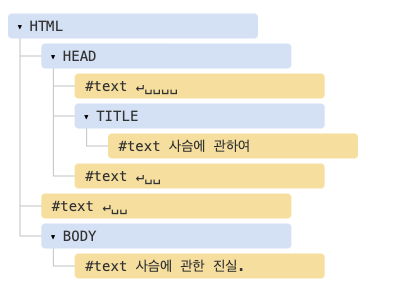
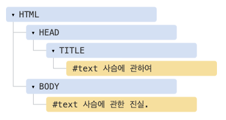

# DOM 트리

- `HTML`을 지탱하는 것은 태그(tag)입니다.
- 문서 객체 모델(DOM)에 따르면, 모든 `HTML` 태그는 객체입니다. 태그 하나가 감싸고 있는 ‘자식’ 태그는 중첩 태그(nested tag)라고 부릅니다. 태그 내의 문자(text) 역시 객체입니다.
- 이런 모든 객체는 자바스크립트를 통해 접근할 수 있고, 페이지를 조작할 때 이 객체를 사용합니다.
- `document.body`는 `<body>` 태그를 객체로 나타낸 것이죠.
- 아래 예시를 실행하면 `<body>`가 3초간 붉은색으로 변경됩니다.

```js
document.body.style.background = "red"; // 배경을 붉은색으로 변경하기

setTimeout(() => (document.body.style.background = ""), 3000); // 원상태로 복구하기
```

- 위 예시에선 `document.body`의 배경색을 바꾸기 위해 `style.background`을 사용했는데, 이 외에도 다양한 프로퍼티가 존재합니다.
- `innerHTML` – 해당 노드의 `HTML` 콘텐츠
- `offsetWidth` – 해당 노드의 너비(픽셀)

<br>

## DOM 예제

- 간단한 문서를 이용해 `DOM` 구조에 대해 알아봅시다.

```js
<!DOCTYPE HTML>
<html>
<head>
  <title>사슴에 관하여</title>
</head>
<body>
  사슴에 관한 진실.
</body>
</html>
```

- `DOM`은 `HTML`을 아래와 같이 태그 트리 구조로 표현합니다.



- 위 그림에서 요소 노드를 클릭하면 그 자식들을 보거나 숨길 수 있습니다.
- 트리에 있는 노드는 모두 객체입니다.
- 태그는 요소 노드(element node) (혹은 그냥 요소)이고, 트리 구조를 구성합니다.
- `<html>`은 루트 노드가 되고, `<head>`와 `<body>`는 루트 노드의 자식이 됩니다.
- 요소 내의 문자는 텍스트(text) 노드가 됩니다. 위 그림에서 `#text`를 확인해보세요. 텍스트 노드는 문자열만 담습니다. 자식 노드를 가질 수 없고, 트리의 끝에서 잎 노드(leaf node)가 됩니다.
- 위 그림에서 `<title>` 태그는 "사슴에 관하여"라는 텍스트 노드를 자식으로 갖습니다.
- 새 줄(newline): `↵` (자바스크립트에선 `\n`로 표시)
- 공백(space): `␣`
- 새 줄과 공백은 글자나 숫자처럼 항상 유효한 문자로 취급됩니다.
- 따라서 이 두 특수문자는 텍스트 노드가 되고, `DOM`의 일부가 됩니다.
- 위 `HTML` 문서를 보면 `<head>`와 `<title>`사이에 새 줄과 약간의 공백이 있는 것을 볼 수 있는데, 이런 특수문자 역시 `#text` 노드가 됩니다.
- 텍스트 노드 생성엔 두 가지 예외가 있습니다.
- 역사적인 이유로, `<head>` 이전의 공백과 새 줄은 무시됩니다.
- `HTML` 명세서에서 모든 콘텐츠는 `body` 안쪽에 있어야 한다고 했으므로, `</body>` 뒤에 무언가를 넣더라도 그 콘텐츠는 자동으로 `body` 안쪽으로 옮겨집니다.
- 따라서 `</body>` 뒤엔 공백이 있을 수 없습니다.
- 두 예외를 제외하곤 아주 간단합니다. 문서 내에 공백이 있다면 다른 문자와 마찬가지로 텍스트 노드가 됩니다. 그리고 공백을 지우면 텍스트 노드도 사라집니다.
- 공백이 없는 텍스트 노드만으로 `HTML` 문서를 구성하려면 `HTML`을 아래와 같이 만들어야 합니다.

```js
<!DOCTYPE HTML>
<html><head><title>사슴에 관하여</title></head><body>사슴에 관한 진실.</body></html>
```



<br>

### 문자열 양 끝 공백과 공백만 있는 텍스트 노드는 개발자 도구에서 보이지 않습니다.

- `DOM`을 다룰 때 키게 되는 브라우저 개발자 도구(곧 다룰 예정임)에선 문자 맨 앞이나 끝쪽의 공백과 태그 사이의 새 줄 때문에 만들어지는 비어있는 텍스트 노드가 나타나지 않습니다.
- 개발자 도구는 이런 방식으로 화면을 덜 차지하게 만들어졌습니다.
- 공백이나 새 줄이 만들어내는 공간은 `HTML` 문서가 브라우저상에 어떻게 표현되는지 대개는 영향을 끼치지 않습니다.

<br>

## 자동 교정

<br>

[출처]
https://ko.javascript.info/dom-nodes
