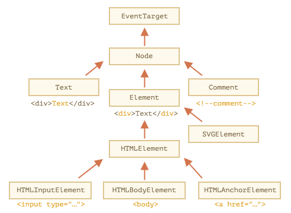

# 주요 노드 프로퍼티

<br>

## DOM 노드 클래스

- DOM 노드는 종류에 따라 각각 다른 프로퍼티를 지원합니다.
- 태그 `<a>`에 대응하는 요소 노드엔 링크 관련된 프로퍼티를, `<input>`에 대응하는 요소 노드엔 입력 관련프로퍼티를 제공하죠.
- 텍스트 노드는 요소 노드와 다른 프로퍼티를 지원하는 것은 말할 필요도 없습니다.
- 그런데 모든 `DOM` 노드는 공통 조상으로부터 만들어지기 때문에 노드 종류는 다르지만, 모든 `DOM` 노드는 공통된 프로퍼티와 메서드를 지원합니다.
- `DOM` 노드는 종류에 따라 대응하는 내장 클래스가 다릅니다.
- 계층 구조 꼭대기엔 `EventTarget`이 있는데, `Node는 EventTarget`을, 다른 `DOM` 노드들은 `Node` 클래스를 상속받습니다.
- 이런 관계를 그림으로 나타내면 다음과 같습니다.



- 각 클래스는 다음과 같은 특징을 지닙니다.
- `EventTarget` – 루트에 있는 ‘추상(abstract)’ 클래스로, 이 클래스에 대응하는 객체는 실제로 만들어지지 않습니다. `EventTarget`가 모든 `DOM` 노드의 베이스에 있기때문에 `DOM` 노드에서 '이벤트’를 사용할 수 있습니다.
- `Node` – 역시 ‘추상’ 클래스로, `DOM` 노드의 베이스 역할을 합니다. `getter` 역할을 하는 `parentNode`, `nextSibling`, `childNodes` 등의 주요 트리 탐색 기능을 제공합니다. `Node` 클래스의 객체는 절대 생성되지 않습니다. 하지만 이 클래스를 상속받는 클래스는 여럿 있습니다. 텍스트 노드를 위한 `Text` 클래스와 요소 노드를 위한 `Element` 클래스, 주석 노드를 위한 `Comment`클래스는 `Node`클래스를 상속받습니다.
- `Element` – `DOM` 요소를 위한 베이스 클래스입니다. `nextElementSibling`, `children` 이나 `getElementsByTagName`, `querySelector` 같이 요소 전용 탐색을 도와주는 프로퍼티나 메서드가 이를 기반으로 합니다. 브라우저는 `HTML`뿐만 아니라 `XML`, `SVG`도 지원하는데 `Element` 클래스는 이와 관련된 `SVGElement`, `XMLElement`, `HTMLElement` 클래스의 베이스 역할을 합니다.
- `HTMLElement` – `HTML` 요소 노드의 베이스 역할을 하는 클래스입니다. 아래 나열한 클래스들은 실제 HTML 요소에 대응하고 `HTMLElement`를 상속받습니다.
  - `HTMLInputElement` – `<input>` 요소에 대응하는 클래스
  - `HTMLBodyElement` – `<body>` 요소에 대응하는 클래스
  - `HTMLAnchorElement` – `<a>` 요소에 대응하는 클래스
  - 이외에도 다른 클래스가 많은데, 각 태그에 해당하는 클래스는 고유한 프로퍼티와 메서드를 지원합니다.
- 이렇게 특정 노드에서 사용할 수 있는 프로퍼티와 메서드는 상속을 기반으로 결정됩니다.
- `<input>` 요소에 대응하는 `DOM` 객체를 예로 들어봅시다. 이 객체는 `HTMLInputElement` 클래스를 기반으로 만들어집니다.
- 객체엔 아래에 나열한 클래스에서 상속받은 프로퍼티와 메서드가 있을 겁니다.
- `HTMLInputElement` – 입력 관련 프로퍼티를 제공하는 클래스
- `TMLElement` – `HTML` 요소 메서드와 `getter`, `setter`를 제공하는 클래스
- `Element` – 요소 노드 메서드를 제공하는 클래스
- `Node` – 공통 `DOM` 노드 프로퍼티를 제공하는 클래스
- `EventTarget` – 이벤트 관련 기능을 제공하는 클래스
- `Object` – `hasOwnProperty`같이 ‘일반 객체’ 메서드를 제공하는 클래스
- 우리는 앞서 객체는 `constructor` 프로퍼티를 가진다는 걸 배운 바 있습니다.
- 이런 특징을 이용하면 `DOM` 노드 클래스 이름을 확인할 수 있습니다. `constructor` 프로퍼티는 클래스 생성자를 참조하고 이름은 `constructor.name`에 저장되어있다는 점을 이용하면 되죠.

```js
alert(document.body.constructor.name); // HTMLBodyElement
```

- `toString`을 사용해도 됩니다.

```js
alert(document.body); // [object HTMLBodyElement]
```

- 상속 여부는 `instanceof`를 사용해 확인할 수 있습니다.

```js
alert(document.body instanceof HTMLBodyElement); // true
alert(document.body instanceof HTMLElement); // true
alert(document.body instanceof Element); // true
alert(document.body instanceof Node); // true
alert(document.body instanceof EventTarget); // true
```

- 지금까지 살펴본 바와 같이 DOM 노드는 프로토타입을 기반으로 상속 관계를 갖는 일반 자바스크립트 객체입니다.
- 브라우저 콘솔에 `console.dir(elem)`를 입력하면 이런 관계를 쉽게 확인할 수 있습니다.
- `HTMLElement.prototype`, `Element.prototype`등이 콘솔에 출력될 겁니다.

<br>

### console.dir(elem)과 console.log(elem)의 차이

- 브라우저 개발자 도구 대부분은 `console.log`와 `console.dir` 명령어를 지원합니다.
- 이 명령어들은 콘솔에 인수를 출력해줍니다. 인수가 자바스크립트 객체라면 두 명령어는 대개 같은 결과를 보여줍니다.
- 하지만 인수가 `DOM` 요소일 때는 결과가 다릅니다.
- `console.log(elem)`는 요소의 DOM 트리를 출력합니다.
- `console.dir(elem)`는 요소를 DOM 객체처럼 취급하여 출력합니다. 따라서 프로퍼티를 확인하기 쉽다는 장점이 있습니다.
- `document.body`를 인수로 넘겨서 그 차이를 직접 확인해보세요

### 명세서에서 쓰이는 IDL

<br>

[출처]
https://ko.javascript.info/basic-dom-node-properties
